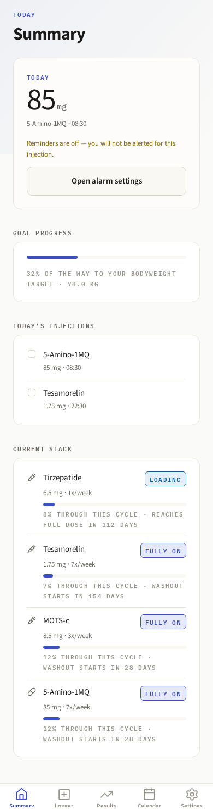
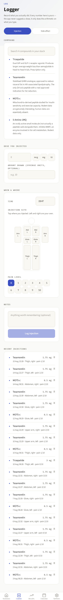
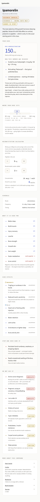
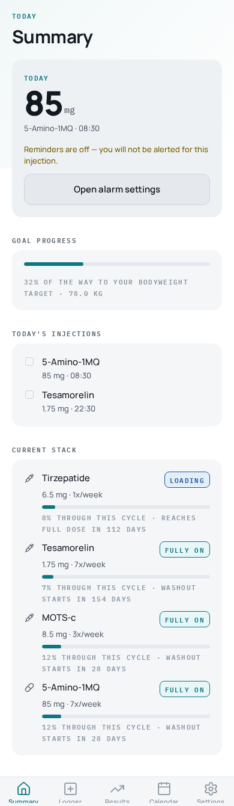
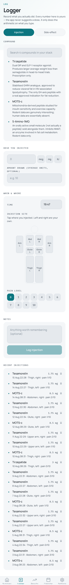
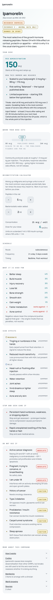
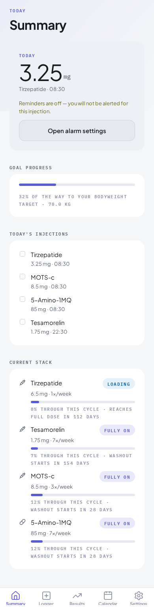
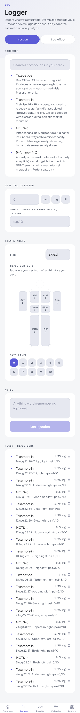
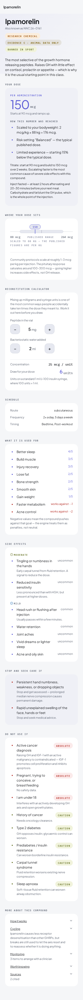

# UI Design Directions — pick one (THEA-55)

Three simple, modern directions for the app, each shown on the same three screens
(**Summary**, **Logger**, **Peptide detail**). All three keep the app's semantic
colour rules (severity scale reserved, brand accent clear of the warning range) and
are CVD-validated. Adapted from free, licence-cleared app UI kits — layout and
structure only, not palette.

Pick the **one** you like best (D1, D2, or D3) and reply on THEA-55.

---

## D1 — Paper
Warm off-white paper surface, high-contrast text, generous whitespace. Calmest,
most editorial feel.

| Summary | Logger | Peptide detail |
|---|---|---|
|  |  |  |

## D2 — Slate
Cooler neutral-grey surface, tighter cards, slightly more data-dense. Most
"clinical dashboard" of the three.

| Summary | Logger | Peptide detail |
|---|---|---|
|  |  |  |

## D3 — Mist
Soft cool-toned surface with a muted olive accent (adjusted from the first pass to
pass CVD contrast). Softest, most consumer-wellness feel.

| Summary | Logger | Peptide detail |
|---|---|---|
|  |  |  |
